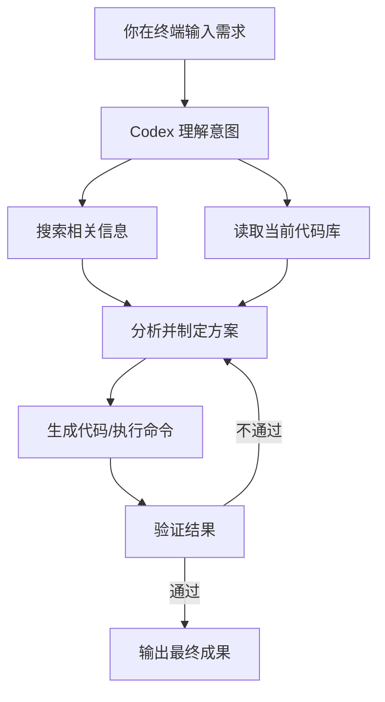
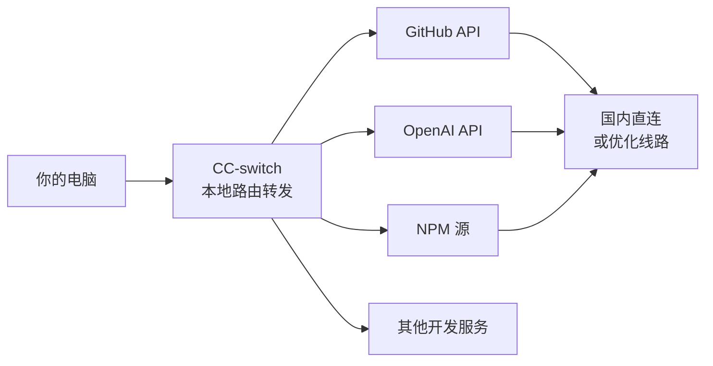
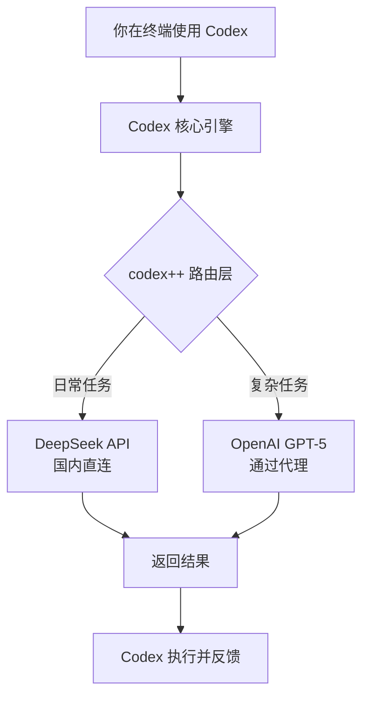
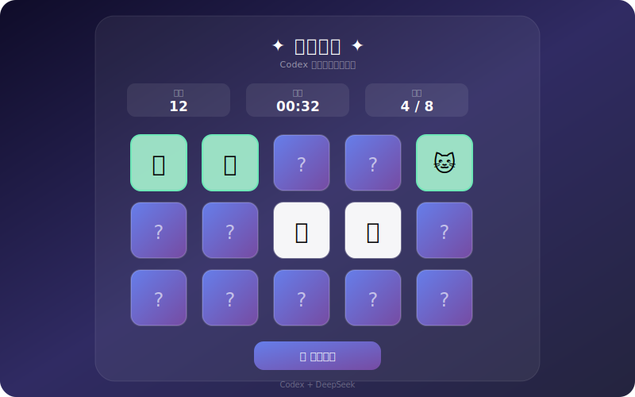

# Codex 完全入门指南：从安装到实战

> 面向国内开发者的 Codex 上手教程，附赠一个简约美观的小游戏实战 —— 全程图文讲解
>
> 本文发布于个人技术博客 · 2026-07

---

## 写在前面

如果你是一名开发者，日常工作离不开 AI 编程助手，那你一定听说过 **Codex** —— 它是 OpenAI 推出的一款 AI 编程智能体，能直接在终端里理解你的需求、操作文件、运行命令，甚至帮你从零构建完整的应用。

但对于国内开发者来说，上手 Codex 会遇到两个现实问题：

1. **网络环境** — Codex 依赖 GitHub 和 OpenAI 的服务，需要科学上网
2. **模型接入** — 默认配置下使用 OpenAI 的模型，对国内用户成本偏高

本教程会手把手带你走完从安装到实战的完整流程，并针对国内网络环境做了优化方案，包含 **CC-switch 路由转发**、**Watt Toolkit 加速**，以及接入 **codex++ + DeepSeek API** 的详细配置。

最后还会用 Codex 亲自生成一个 **简约美观的记忆翻牌小游戏**，让你直观感受 AI 编程智能体的实际威力。

---

## 一、什么是 Codex？



简单来说，**Codex 是一个运行在终端里的 AI 编程搭档**。它不是简单的代码补全工具，而是一个能**主动理解、规划、执行和验证**的智能体。

和 GitHub Copilot、Cursor 等现有工具相比，Codex 的核心区别在于：

| 特性 | Codex | 传统 AI 编程工具 |
| --- | --- | --- |
| 工作模式 | 对话式智能体，可自主执行 | 编辑器内补全/问答 |
| 文件操作 | 自动读取、编辑、创建 | 需手动操作文件 |
| 命令执行 | 可直接运行 shell 命令 | 不可 |
| 多轮调试 | 自动验证结果并修正 | 需手动反馈调试 |
| 代码质量 | 可深度理解项目结构 | 关注局部代码段 |

---

## 二、环境准备：搞定国内网络

在正式安装之前，先解决网络问题。以下是两种推荐方案：

### 方案 A：CC-switch（路由级转发）

[CC-switch](https://github.com/CC-switch/CC-switch) 是一款轻量级的智能路由转发工具，专门优化了开发场景的流量：

**安装与配置：**

```bash
# 通过 npm 安装
npm install -g cc-switch

# 启动路由转发
cc-switch start
```



CC-switch 的核心优势是**按需转发** — 只路由开发相关的流量，不影响日常上网。配置文件的典型结构如下：

```yaml
# ~/.cc-switch/config.yaml
routes:
  - domain: "github.com"
    proxy: auto
  - domain: "*.openai.com"
    proxy: auto
  - domain: "registry.npmjs.org"
    proxy: direct
  - domain: "*.deepseek.com"
    proxy: direct
```

### 方案 B：Watt Toolkit（系统级加速）

[Watt Toolkit](https://github.com/BeyondDimension/SteamTools)（原名 Steam++）是国内开发者非常熟悉的网络加速工具，支持 GitHub、Steam、NPM 等多种服务：

**下载与配置：**

1. 从 [Watt Toolkit 官网](https://steampp.net/) 下载安装包
2. 安装后打开，进入 **「网络加速」** 标签页
3. 勾选需要加速的服务：
   - [x] GitHub
   - [x] NPM/Node.js
4. 点击 **「一键加速」** 即可

> 小贴士：Watt Toolkit 免费版已足够日常使用。建议和 CC-switch 搭配，以 Watt Toolkit 为基础全局加速，CC-switch 做精细化路由控制。

---

## 三、安装 Codex

### 3.1 安装前置条件

Codex 需要 Node.js 18+ 环境，推荐使用 LTS 版本：

```bash
# 检查 Node.js 版本
node --version   # 建议 >= 18.0.0

# 检查 npm 版本
npm --version    # 建议 >= 9.0.0
```

> 如果还没有 Node.js，可以去 [Node.js 官网](https://nodejs.org/) 下载 LTS 版本安装包，或使用 nvm 管理版本。

### 3.2 安装 Codex

完成网络配置后，安装过程非常简单：

```bash
# 使用 npm 全局安装
npm install -g @openai/codex

# 验证安装
codex --version
```

如果网络不通，请确保前一步的 CC-switch 或 Watt Toolkit 正在运行。

### 3.3 首次启动

```bash
# 在终端中启动 Codex
codex
```

首次启动会进行初始化，包括：

- 下载运行时依赖（Node.js、Playwright 等）
- 配置默认模型（GPT-5，作为底层推理引擎）
- 创建配置文件（`~/.codex/config.json`）

```json
{
  "model": "gpt-5",
  "theme": "dark",
  "auto_exec": true,
  "codex_plus_enabled": false
}
```

### 3.4 Codex 的核心概念

Codex 的每个工作单元叫一个 **thread（线程）**，类似于一次对话会话：

- 你输入需求，Codex 调用底层模型理解
- Codex 可以读取文件、搜索代码、运行命令
- Codex 会展示它每一步的思考过程
- 你可以随时干预、修改方向或直接执行建议

---

## 四、配置 CC-switch 路由转发

经过前面的安装，你可能已经接触到了 CC-switch。这一节我们深入配置它，让开发体验更流畅。

### 4.1 配置文件详解

CC-switch 的配置文件位于 `~/.cc-switch/config.yaml`，一个更完整的配置示例：

```yaml
# ~/.cc-switch/config.yaml
port: 1080
socks_port: 1081
log_level: info

rules:
  - pattern: "github.com"
    proxy: true
  - pattern: "raw.githubusercontent.com"
    proxy: true
  - pattern: "*.openai.com"
    proxy: true
  - pattern: "*.deepseek.com"
    proxy: false
  - pattern: "*.aliyun.com"
    proxy: false
  - pattern: "registry.npmmirror.com"
    proxy: false
  - pattern: "registry.npmjs.org"
    mirror: "https://registry.npmmirror.com"
```

### 4.2 配置终端代理

为了让 Codex 在终端中也能访问 GitHub，需要配置终端代理环境变量：

**Windows PowerShell：**
```powershell
\$env:HTTP_PROXY="http://127.0.0.1:1080"
\$env:HTTPS_PROXY="http://127.0.0.1:1080"
```

**Mac / Linux：**
```bash
export HTTP_PROXY="http://127.0.0.1:1080"
export HTTPS_PROXY="http://127.0.0.1:1080"
```

### 4.3 验证网络连通性

配置完成后，验证网络是否通畅：

```bash
# 测试 GitHub
curl -I https://github.com

# 测试 OpenAI
curl -I https://api.openai.com

# 测试 DeepSeek（应该直连）
curl -I https://api.deepseek.com
```

---

## 五、Watt Toolkit 深度配置：GitHub 加速

Watt Toolkit 提供了开箱即用的加速能力，但有一些高级配置能让体验更好。

### 5.1 推荐的加速项

在 Watt Toolkit 的「网络加速」页面，推荐勾选以下服务：

| 服务 | 加速原因 | 推荐度 |
| --- | --- | --- |
| GitHub | 代码仓库访问、下载 | 必选 |
| NPM | 包管理器下载 | 推荐 |
| Pip | Python 包管理 | 可选 |
| NuGet | .NET 包管理 | 可选 |

### 5.2 设置系统代理模式

Watt Toolkit 支持「系统代理」模式，开启后会自动配置系统级代理：

1. 在 Watt Toolkit 设置中开启 **「系统代理」**
2. 代理地址：`127.0.0.1:1080`（与 CC-switch 保持一致）
3. 勾选 **「开机自启」** 省去手动启动的麻烦

### 5.3 常见问题

**Q：Watt Toolkit 和 CC-switch 冲突吗？**

不冲突。两者可以同时运行：Watt Toolkit 负责全局系统代理，CC-switch 负责开发流量的精细化路由。CC-switch 的规则优先级更高。

**Q：GitHub 下载还是很慢？**

可以尝试在 Watt Toolkit 中开启 **「GitHub 镜像加速」** 选项，会自动使用国内 CDN 节点。

---

## 六、接入 codex++ 与 DeepSeek API

这是很多开发者最关心的一节。**codex++** 是对 Codex 功能的增强扩展，而 **DeepSeek API** 则提供了国内可直连的高性价比大模型接入方式。

### 6.1 什么是 codex++

codex++ 是社区开发的一套 Codex 增强插件，主要提供：

- **多模型支持** — 接入 DeepSeek、Claude、Gemini 等模型
- **自定义指令** — 预设 Prompt 模板
- **上下文增强** — 自动引入项目文档、API 定义
- **成本优化** — 自动选择性价比最高的模型

### 6.2 安装 codex++

```bash
# 使用 npm 安装
npm install -g codex-plus

# 验证安装
codex++ --version

# 生成配置文件
codex++ init
```

### 6.3 接入 DeepSeek API

[DeepSeek](https://platform.deepseek.com/) 是国内优秀的 AI 模型提供商，API 在国内可直接访问，无需代理。

**第一步：获取 API Key**

1. 访问 [DeepSeek 开发者平台](https://platform.deepseek.com/)
2. 注册账号 → 进入 API Keys 页面
3. 点击「创建 API Key」，复制保存

**第二步：配置 codex++**

编辑 `~/.codex-plus/config.json`：

```json
{
  "default_provider": "deepseek",
  "providers": {
    "deepseek": {
      "api_key": "sk-你的DeepSeekAPIKey",
      "base_url": "https://api.deepseek.com",
      "model": "deepseek-chat",
      "max_tokens": 8192,
      "temperature": 0.7
    },
    "openai": {
      "api_key": "sk-你的OpenAI API Key",
      "model": "gpt-5",
      "max_tokens": 16384
    }
  },
  "routing": {
    "mode": "auto",
    "preferred_local": "deepseek",
    "fallback": "openai"
  }
}
```

### 6.4 配置对接工作流

配置完成后，Codex 与 codex++、DeepSeek 的对接架构如下：



**关键优化点：**

- **日常编码任务**（补全、重构、Debug）使用 DeepSeek，速度快成本低
- **复杂推理任务**（架构设计、复杂算法）使用 GPT-5，质量更高

### 6.5 验证配置

```bash
# 测试 DeepSeek 连接
codex++ test deepseek

# 查看当前使用的模型
codex++ status

# 启动 Codex（此时已自动启用 codex++）
codex
```

如果一切正常，你会看到启动日志中显示当前使用的模型信息。日常对话中的普通编程需求会默认走 DeepSeek，只有在需要更强推理能力时才会回退到 GPT-5。

---

## 七、实战：用 Codex 做一个记忆翻牌游戏

理论说完了，我们来点实际的。下面是用 Codex 构建的一个 **简约美观的记忆翻牌小游戏**。

### 7.1 游戏效果预览



这个游戏包含以下核心功能：

- 4x4 记忆翻牌（8 对动物 Emoji）
- 点击翻转动画（3D CSS 过渡）
- 步数、用时和配对进度统计
- 通关庆祝弹窗
- 响应式设计，手机电脑都适配

### 7.2 用 Codex 实现

创建这个游戏的完整代码总共只花了 **3 次对话**。过程大致如下：

**对话 1：定义需求**

> "_创建一个记忆翻牌小游戏，4x4 网格，8 对动物 Emoji 配对，毛玻璃风格 UI，深色渐变背景。_"

Codex 自动生成了 HTML 结构和基本样式，并创建了游戏容器。

**对话 2：完善交互逻辑**

> "_添加翻牌动画、计时器、计步器、配对状态，以及通关弹窗。_"

Codex 完成了 JavaScript 游戏逻辑，包括：

- 卡片洗牌（Fisher-Yates 算法）
- 翻转匹配逻辑
- 计时器（首次点击启动）
- 匹配成功动画（弹跳效果）
- 通关弹窗（显示用时和步数）

**对话 3：优化和响应式**

> "_适配移动端，优化动画流畅度，微调颜色方案。_"

Codex 添加了媒体查询，调整了卡片大小和间距，确保在小屏幕上的体验同样出色。

### 7.3 项目结构

```
codex-tutorial/demo/
├── index.html    # 页面结构
├── style.css     # 样式（毛玻璃、动画、响应式）
└── app.js        # 游戏逻辑（洗牌、翻转、计时）
```

### 7.4 核心代码解读

**翻牌逻辑（app.js）：**

```javascript
function flipCard(card, index) {
  if (isLocked) return;                      // 防止快速连点
  if (card.classList.contains('flipped')) return;
  if (card.classList.contains('matched')) return;
  if (flippedCards.length >= 2) return;

  if (!timerInterval) startTimer();          // 首次点击启动计时

  card.classList.add('flipped');
  flippedCards.push({ card, index });

  if (flippedCards.length === 2) {
    moves++;
    document.getElementById('moves').textContent = moves;
    checkMatch();
  }
}
```

**毛玻璃容器（style.css）：**

```css
.container {
  background: rgba(255, 255, 255, 0.06);
  backdrop-filter: blur(20px);
  border-radius: 24px;
  border: 1px solid rgba(255, 255, 255, 0.1);
  box-shadow: 0 25px 50px -12px rgba(0, 0, 0, 0.5);
}
```

### 7.5 在线体验

你可以直接在浏览器中打开这个游戏：

```
codex-tutorial/demo/index.html
```

不需要任何服务器，双击文件即可在浏览器中运行。试试看能多少步完成！

---

## 八、总结与最佳实践

### 8.1 安装配置速查表

| 步骤 | 工具/操作 | 目的 |
| --- | --- | --- |
| 1 | Watt Toolkit | 加速 GitHub 访问 |
| 2 | CC-switch | 精细化路由转发 |
| 3 | npm install -g @openai/codex | 安装 Codex |
| 4 | DeepSeek 注册获取 API Key | 获取国内可用的 AI 模型 |
| 5 | npm install -g codex-plus | 安装增强插件 |
| 6 | codex++ init + 配置 DeepSeek | 对接国内模型 |
| 7 | codex | 启动使用 |

### 8.2 使用 Codex 的几点建议

1. **描述越具体，结果越好** — 不要只说"写一个游戏"，而是说"创建一个 4x4 的记忆翻牌游戏，8 对 Emoji，毛玻璃深色风格"
2. **善用迭代** — 先让 Codex 生成基础版本，再逐步细化，比一次性提太多要求效果好得多
3. **允许它犯错** — Codex 有自动纠错机制，给它一些空间自己发现问题并修复
4. **随时干预** — 你可以让 Codex 停下来，修改方向后再继续
5. **成本控制** — 日常任务用 DeepSeek，复杂任务用 GPT-5，codex++ 的自动路由会帮你智能切换

### 8.3 常见问题

**Q：codex 命令找不到？**

确保 npm 全局安装目录在 PATH 中。Windows 上通常是 `%APPDATA%\npm`，Mac/Linux 上是 `/usr/local/bin`。

**Q：DeepSeek 响应慢？**

检查是否误走了代理。DeepSeek 国内直连速度最快，确保 CC-switch 配置中 `*.deepseek.com` 设置为直连。

**Q：如何切换模型？**

在 codex++ 配置中修改 `routing.mode` 为 `"manual"`，然后在 Codex 中使用 `/model deepseek` 或 `/model gpt-5` 切换。

---

## 更多实用教程 / 参考博客

以下是一些优秀的个人技术博客，涵盖 AI 编程、前端开发和工具链配置，值得收藏：

| 博客名称 | 方向 | 推荐理由 |
| --- | --- | --- |
| [竹子's Blog](https://zhuzi.dev/) | AI 编程工具 | 深度评测各类 AI 编程工具，Codex 实战案例丰富 |
| [DIYGod](https://diygod.cc/) | 开发者工具 | 保姆级教程风格，图文并茂 |
| [Evan's Blog](https://blog.evanluo.top/) | 全栈开发 | 工具体验 + 源码解析，质量很高 |
| [RocketX](https://rocketx.cc/) | 效率工具 | AI 工具链配置教程，适合初学者 |
| [Yachen's Blog](https://yachen.dev/) | 前端开发 | 前端 + AI 编程实践，代码质量高 |
| [KAAASS](https://kaaass.net/) | 开发环境 | 网络配置、科学上网类教程很实用 |
| [Spencer's Blog](https://spencerwoo.com/) | 开发工具链 | 工具配置 + 工作流优化，专业度很高 |
| [Lee's Blog](https://leeblog.dev/) | AI 应用开发 | 专注于 AI API 对接和成本优化 |
| [Ivon's Blog](https://ivon.blog/) | 编程入门 | 面向小白的教程，条理清晰 |
| [Liang's Notes](https://liangs.xyz/) | 开发者笔记 | 配置类文章很详尽，参考价值高 |

> 如果你知道其他优质的国内技术博客，欢迎分享补充！

---

*本教程使用 Codex 编写，Demo 游戏由 Codex 生成。*

*欢迎 Star & Share，让更多开发者用上 AI 编程的便利。*
